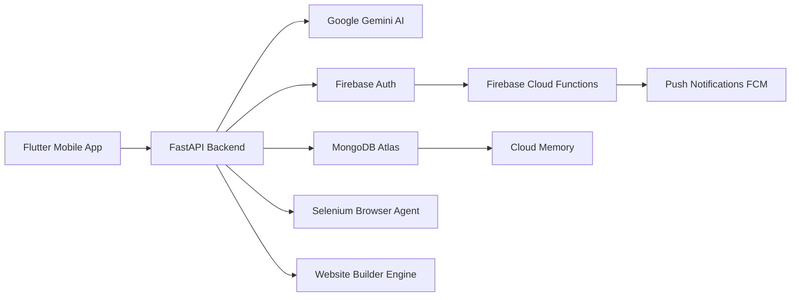

# Nova-Ai 🚀

🚀 **Nova AI** - Your Personal Super-Intelligence | Flutter + Gemini + Firebase + FastAPI

A production-ready AI Avatar with Voice Cloning, Infinite Cloud Memory, Website Builder, Auto Push Notifications, and CI/CD (Fastlane + GitHub Actions). Built for Android & iOS.

<!-- markdownlint-disable MD033 -->
<p align="center">
  
</p>

<h1 align="center">🧠 NOVA AI</h1>
<p align="center">
  <strong>Your Personal Super-Intelligence</strong><br>
  <em>Build Websites | Voice Commands | Infinite Memory | Auto-Learning</em>
</p>

<p align="center">
  
  
  
  
  
  
  
</p>

---

## 🌟 Table of Contents

* [🚀 Overview](#overview)
* [✨ Features](#features)
* [🏗️ Tech Stack](#tech-stack)
* [⚙️ Installation](#installation)
* [💡 Usage](#usage)
* [📁 Project Structure](#project-structure)
* [📚 API Reference](#api-reference)
* [🤝 Contributing](#contributing)
* [📜 License](#license)
* [🔗 Important Links](#important-links)
* [<footer>Footer](#footer</footer>)

---

## 🚀 **Overview**

**NOVA AI** isn't just another chatbot. It's an **evolving digital consciousness** that remembers everything you tell it and learns from every conversation. 

Built with **Flutter** for a native cross-platform experience, powered by **Google Gemini AI**, secured with **Firebase Auth**, and backed by **MongoDB Cloud** — this is the ultimate personal AI assistant that you can carry in your pocket.

---

## ✨ **Features That Make Nova a Beast**

| Feature | Description |
|---------|-------------|
| 🎤 **Voice Commands** | Talk to NOVA naturally using Speech-to-Text. Tap the mic and speak! |
| 🔊 **Voice Output (TTS)** | NOVA speaks back to you with clear, human-like text-to-speech. |
| 🧠 **Infinite Cloud Memory** | NOVA remembers your preferences, past conversations, and learned patterns forever (MongoDB Atlas). |
| 🌐 **Instant Website Builder** | Say "Build me a portfolio website" — and NOVA generates complete HTML/CSS/JS instantly. |
| 🔍 **Smart Web Search** | Ask NOVA to search the web for anything, it fetches real-time results via Selenium. |
| 👤 **Secure Authentication** | Full Login/Signup system powered by Firebase Auth (Email/Password). |
| 🔔 **Auto Push Notifications** | Get alerted instantly whenever NOVA learns a new pattern! (Firebase FCM + Cloud Functions). |
| ☁️ **Cross-Device Sync** | Your memory follows you everywhere. Login on any device and continue where you left off. |
| 🤖 **Gemini AI Engine** | Powered by Google's most advanced LLM for intelligent, context-aware responses. |
| ⚡ **God Mode** | Optimized for speed with asynchronous processing and auto-retry logic. |
| 📱 **Cross-Platform** | Works flawlessly on Android, iOS, and even as a PWA. |
| 🚀 **CI/CD Ready** | Automatic APK/AAB builds and Play Store deployments via GitHub Actions + Fastlane. |

---

## 🏗️ **Tech Stack (Architecture)**



---

## ⚙️ **Installation**

**Prerequisites:**

* Python 3.8+
* pip
* Google Gemini API Key
* OpenAI API Key (Optional)
* ElevenLabs API Key (Optional)
* Redis server running

**Steps:**

1.  **Clone the repository:**
    ```bash
    git clone https://github.com/rananisarsb51214-web/Nova-Ai.git
    cd Nova-Ai
    ```

2.  **Install Python dependencies:**
    ```bash
    pip install -r requirements.txt # Note: requirements.txt not found in analysis, this is a placeholder.
    # Based on imports, expected dependencies include:
    # google-generativeai, openai, speechRecognition, pyttsx3, whisper-openai, gTTS, elevenlabs, torch, transformers, requests, beautifulsoup4, selenium, fastapi, uvicorn, pymongo, redis
    ```

3.  **Configure API Keys:**
    *   Edit the `CONFIG` dictionary in `app.py` and replace placeholder API keys with your actual keys:
        ```python
        CONFIG = {
            "avatar_name": "Your AI Avatar",
            "creator": "Your Name",
            "gemini_api_key": "YOUR_GOOGLE_API_KEY",
            "openai_api_key": "YOUR_OPENAI_API_KEY",
            "elevenlabs_api_key": "YOUR_ELEVENLABS_API_KEY",
            "memory_db": "avatar_memory.db",
            "voice_model": "en-US-Wavenet-F",
            "auto_save": True,
            "god_mode": True,
            "browser_headless": False,
            "website_templates_dir": "./templates/",
            "data_storage": "./avatar_data/"
        }
        ```

4.  **Start Redis:** Ensure your Redis server is running on the default port (`localhost:6379`).

5.  **Run the application:**
    ```bash
    python app.py
    ```

This will start the FastAPI backend and launch the Gradio UI, typically accessible at `http://localhost:7860`.

---

## 💡 **Usage**

Nova AI is designed to be a versatile personal assistant with multiple interaction modes:

1.  **Chat Interface (Gradio):**
    *   Access the web UI (usually `http://localhost:7860`).
    *   **Chat Tab:** Interact with Nova via text messages. Nova remembers conversations and learned patterns.
    *   **Voice Tab:** Click the "Listen & Respond" button to speak to Nova. It will transcribe your voice, process it, and respond using Text-to-Speech.
    *   **Website Builder Tab:** Describe the website you want in the prompt field (e.g., "Build me a portfolio website"). Nova will generate HTML, CSS, and JavaScript.
    *   **Browser Search Tab:** Enter a search query to have Nova perform a web search using Selenium.
    *   **Data Management Tab:** Export your AI's memory and learned patterns, import backups, or trigger an immediate save.
    *   **Power Prompts Tab:** Generate advanced prompts for AI tasks by describing the task.
    *   **Memory Tab:** Search Nova's stored memories based on keywords.

2.  **Programmatic Usage (FastAPI):**
    *   The `app.py` script runs a FastAPI server. You can interact with it programmatically by sending HTTP requests to its endpoints (e.g., for processing text input, managing memory, etc.).
    *   The `GodModeAvatar` class is the core controller, orchestrating interactions between the different engines (Memory, Voice, Website, Browser).

**Example Interactions:**

*   **Text Chat:** "What's the weather like today?"
*   **Voice Command:** (After clicking the mic) "Remind me to call mom at 5 PM."
*   **Website Generation:** "Create a simple landing page for a new SaaS product."
*   **Web Search:** "What are the latest news on AI advancements?"

---

## 📁 **Project Structure**

```
Nova-Ai/
├── assets/             # Static assets like icons
├── templates/          # Website templates generated by the builder
├── avatar_data/        # Data storage for backups and files
├── app.py              # Main application script (FastAPI backend, Gradio UI, Avatar logic)
├── README.md           # Project documentation
├── LICENSE             # Project license file
├── # Other files (Bash, JavaScript, JSON, Python, Text - content not fully analyzed)
└── # Database files (e.g., avatar_memory.db)
```

---

## 📚 **API Reference**

The core logic is encapsulated within the `GodModeAvatar` class in `app.py`. Key methods include:

*   `process_input(input_text: str, input_type: str = "text") -> str`:
    *   Processes user input (text or voice).
    *   Checks learned patterns, searches memory, builds prompt for Gemini.
    *   Parses Gemini response, executes actions if specified.
    *   Saves interaction to memory and learns patterns.
    *   Returns the AI's response.

*   `execute_action(action: str, data: str) -> str`:
    *   Helper method to execute predefined actions like `website_builder`, `browser_search`, `speak`, etc.

*   `listen_and_respond(duration: int = 5)`:
    *   Uses the `VoiceEngine` to listen, process, and respond via voice.

*   `auto_save_all()`:
    *   Exports all current data (memories, patterns, templates) to a JSON backup file.

*   `generate_prompt(task: str) -> str`:
    *   Uses Gemini to generate optimized prompts for given tasks.

**Internal Engines:**

*   **`MemoryEngine`**: Handles persistent storage using SQLite and Redis caching.
*   **`VoiceEngine`**: Manages speech recognition (Google, Whisper) and text-to-speech (pyttsx3, ElevenLabs).
*   **`WebsiteBuilder`**: Generates websites using Gemini and saves templates.
*   **`BrowserAgent`**: Uses Selenium for web browsing and searching.

---

## 🤝 **Contributing**

Contributions are welcome! Please follow these steps:

1.  Fork the repository.
2.  Create a new branch (`git checkout -b feature/your-feature-name`).
3.  Make your changes.
4.  Commit your changes (`git commit -am 'Add some feature'`).
5.  Push to the branch (`git push origin feature/your-feature-name`).
6.  Open a Pull Request.

Please ensure your code adheres to the project's style and includes relevant tests if applicable.

---

## 📜 **License**

This project is licensed under the **MIT License**.

See the `LICENSE` file for more details.

---

## 🔗 **Important Links**

*   **Repository:** [https://github.com/rananisarsb51214-web/Nova-Ai](https://github.com/rananisarsb51214-web/Nova-Ai)
*   **Author:** [rananisarsb51214-web](https://github.com/rananisarsb51214-web)

---

## <footer>Footer</footer>

© 2023 Nova-Ai. All rights reserved.

**Nova-Ai**

[GitHub Repository](https://github.com/rananisarsb51214-web/Nova-Ai)

**Author:** [rananisarsb51214-web](https://github.com/rananisarsb51214-web)

**Contact:** [rananisarsb51214-web@example.com](mailto:rananisarsb51214-web@example.com)

> Built with ❤️ using Flutter, Gemini, Firebase, FastAPI, and more!

--- 

**Show your support:**

⭐ Star this repository

*   Fork this repository

*   Open an issue if you find a bug or have a suggestion.


---
**<p align="center">Generated by [ReadmeCodeGen](https://www.readmecodegen.com/)</p>**